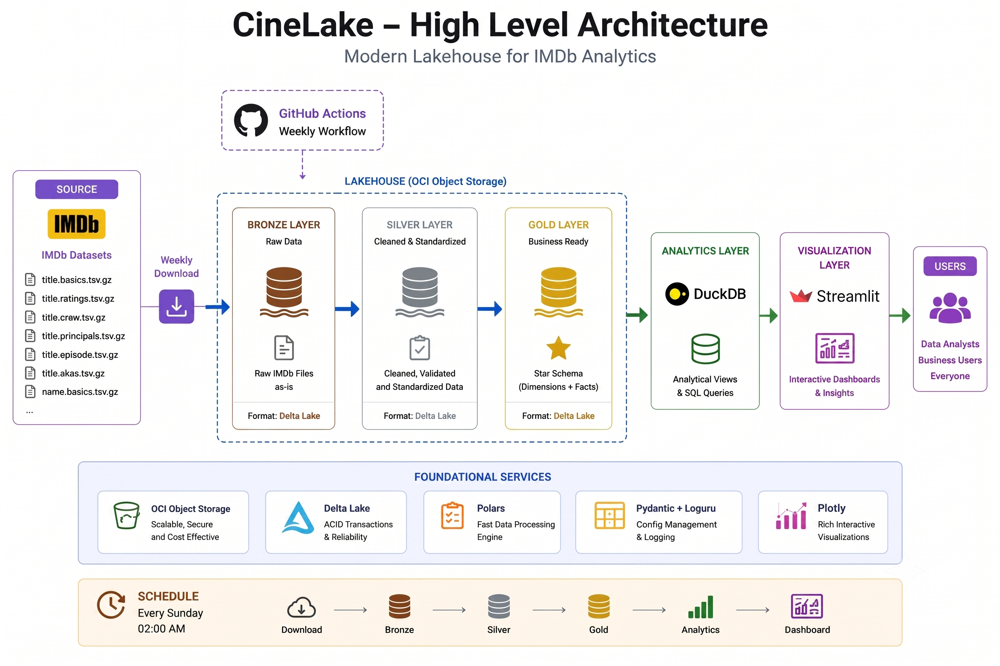

# CineLake - Phase 4: Architecture Design

Status: ✅ COMPLETED

## Objective

Design a modern Lakehouse Architecture for ingesting, processing, storing, analyzing, and visualizing IMDb datasets.

The architecture follows the Medallion Architecture pattern:

* Bronze Layer (Raw)
* Silver Layer (Cleaned)
* Gold Layer (Business Ready)

and is optimized for:

* OCI Free Tier
* Weekly Data Refresh
* Analytics Workloads
* Portfolio Demonstration
* Future Scalability


---

# Architecture Principles

## Simplicity First

Version 1 prioritizes:

* Simplicity
* Maintainability
* Low Cost
* Learning Value

---

## Cloud Native

Primary Storage:

* Oracle OCI Object Storage

---

## Lakehouse Design

Storage Format:

* Delta Lake

Benefits:

* ACID Transactions
* Schema Enforcement
* Future MERGE Support
* Time Travel Support (Future)

---

# Technology Stack

## Development

* Python 3.13
* UV
* Ruff
* Pytest
* Pre-commit

---

## Configuration & Logging

* Pydantic Settings
* Loguru
* Rich

---

## Data Ingestion

* HTTPX

---

## Data Processing

* Polars
* PyArrow

---

## Storage

* Delta Lake
* OCI Object Storage

---

## Analytics

* DuckDB

---

## Visualization

* Streamlit
* Plotly

---

## Automation

* GitHub Actions

---

# High Level Architecture

IMDb Datasets

↓

GitHub Actions

↓

HTTPX Downloader

↓

Bronze Layer

↓

Silver Layer

↓

Gold Layer

↓

DuckDB Analytics Layer

↓

Streamlit Dashboard

↓

End Users

---

# Source Layer

## IMDb Datasets

Weekly Downloads

Datasets:

* title.basics.tsv.gz
* title.ratings.tsv.gz
* title.crew.tsv.gz
* title.principals.tsv.gz
* title.episode.tsv.gz
* title.akas.tsv.gz
* name.basics.tsv.gz

Refresh Frequency:

Weekly

Schedule:

Every Sunday

---

# Bronze Layer

## Purpose

Store raw IMDb data.

## Characteristics

* Raw Data
* Minimal Transformations
* Source Fidelity
* Delta Format

## Tables

bronze_title_basics

bronze_title_ratings

bronze_title_crew

bronze_title_principals

bronze_title_episode

bronze_title_akas

bronze_name_basics

## Load Strategy

Full Refresh

Overwrite

---

# Silver Layer

## Purpose

Store cleaned and standardized data.

## Characteristics

* Null Handling
* Type Conversion
* Standardized Columns
* Data Quality Validation

## Example Transformations

### title.basics

Before:

genres

```text
Action,Adventure,Sci-Fi
```

After:

genre_1 = Action

genre_2 = Adventure

genre_3 = Sci-Fi

---

### Null Handling

Before:

\N

After:

NULL

---

### Type Conversion

startYear

String

↓

Integer

---

## Load Strategy

Full Refresh

Overwrite

---

# Gold Layer

## Purpose

Business-ready dimensional model.

## Characteristics

* Star Schema
* SCD Type 1
* Analytical Optimization

---

## Dimension Tables

dim_movie

dim_person

dim_date

dim_region

dim_language

---

## Fact Tables

fact_movie_rating

fact_cast

fact_director

fact_writer

fact_episode

fact_localization

---

## Load Strategy

Full Refresh

Overwrite

---

# DuckDB Analytics Layer

## Purpose

Provide SQL analytics serving layer.

## Responsibilities

* Query Gold Tables
* Create Analytical Views
* Power Dashboards

---

## Example Views

vw_top_movies

vw_top_actors

vw_top_directors

vw_genre_rankings

vw_tv_series_rankings

vw_language_distribution

---

# Dashboard Layer

## Framework

Streamlit

---

## Visualization Library

Plotly

---

## Dashboard Pages

### Overview

KPIs

### Movie Analytics

Ratings
Votes
Trends

### Genre Analytics

Genre Rankings

### Actor Analytics

Actor Performance

### Director Analytics

Director Performance

### Writer Analytics

Writer Performance

### TV Analytics

Series & Episode Analysis

### Search & Discovery

Movie Search

Actor Search

Director Search

TV Series Search

---

# Storage Layout

OCI Object Storage

cinelake/

bronze/

silver/

gold/

---

# Data Refresh Flow

Sunday 02:00 AM

↓

GitHub Actions Trigger

↓

Download IMDb Files

↓

Build Bronze Layer

↓

Build Silver Layer

↓

Build Gold Layer

↓

Refresh DuckDB

↓

Dashboard Ready

---

# Load Strategy

Version 1

Full Refresh

Reason:

* Simpler Architecture
* IMDb Updates Weekly
* OCI Free Tier Friendly
* Easier Maintenance

---

# Monitoring

## Logging

Loguru

Tracks:

* Download Progress
* Processing Steps
* Errors
* Execution Time

---

## Console Visualization

Rich

Displays:

* Progress Bars
* Tables
* Status Messages

---

# Future Architecture Enhancements

## V2

* Rating Snapshot Facts
* Historical Trend Analysis

---

## V3

* Incremental Processing
* Delta MERGE

---

## V4

* SCD Type 2
* Historical Dimensions

---

# Architecture Decisions

| Decision           | Reason                                                                                                |
| ------------------ | ----------------------------------------------------------------------------------------------------- |
| Polars over Pandas | Better performance                                                                                    |
| Delta Lake         | Lakehouse architecture                                                                                |
| OCI Object Storage | Free cloud storage                                                                                    |
| DuckDB             | Embedded analytics engine                                                                             |
| Streamlit          | Fast dashboard development                                                                            |
| Full Refresh       | Entire table is rebuilt weekly using latest IMDb data (previous data is overwritten, no history kept) |
| SCD Type 1         | Lower storage usage                                                                                   |

---

# Phase 4 Deliverables

* Architecture Document
* Technology Stack Definition
* Storage Design
* Data Flow Design
* Layer Definitions

---
