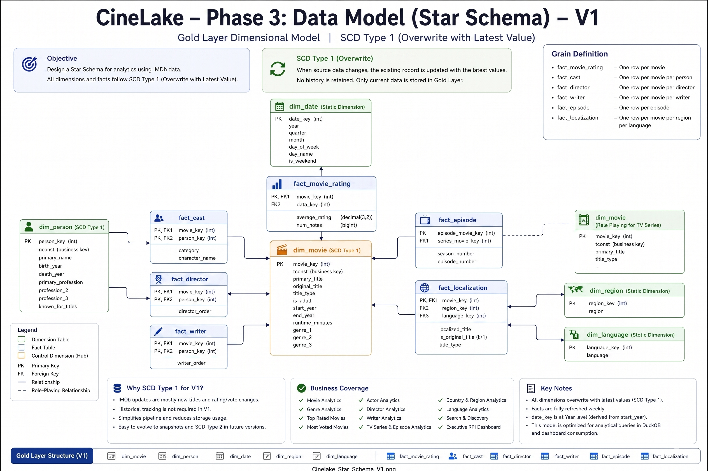

# CineLake - Phase 3: Data Modeling (Star Schema V1)

Status: ✅ COMPLETED

## Objective

Design a dimensional model (Star Schema) optimized for analytical workloads using IMDb datasets.

Version 1 follows a simple SCD Type 1 strategy where records are overwritten with the latest values during weekly refreshes.

The model serves as the foundation for:

* Gold Layer Delta Tables
* DuckDB Analytics Layer
* Streamlit Dashboard
* Search & Discovery Features

---

# Modeling Approach

Business Requirements
↓
Source System Analysis
↓
Identify Entities
↓
Identify Relationships
↓
Identify Measures
↓
Design Dimensions
↓
Design Facts
↓
Build Star Schema

---

# SCD Strategy

## Version 1

All dimensions use:

### SCD Type 1

When source data changes:

* Existing records are updated
* Previous values are overwritten
* No historical tracking maintained

Reason:

* IMDb primarily adds new titles and updates ratings
* OCI Free Tier storage constraints
* Simpler implementation
* Faster development

Future versions may introduce:

* Rating Snapshot Facts
* SCD Type 2 Dimensions
* Incremental Processing

---

# Dimension Tables

## dim_movie

### Source

title.basics

### Primary Key

movie_key

### Business Key

tconst

### Attributes

* movie_key
* tconst
* primary_title
* original_title
* title_type
* is_adult
* start_year
* end_year
* runtime_minutes
* genre_1
* genre_2
* genre_3

### SCD Strategy

Type 1

---

## dim_person

### Source

name.basics

### Primary Key

person_key

### Business Key

nconst

### Attributes

* person_key
* nconst
* primary_name
* birth_year
* death_year
* primary_profession
* known_for_titles

### SCD Strategy

Type 1

---

## dim_date

### Source

Derived

### Primary Key

date_key

### Attributes

* date_key
* year
* decade

### SCD Strategy

Static Dimension

---

## dim_region

### Source

title.akas

### Primary Key

region_key

### Attributes

* region_key
* region

### SCD Strategy

Static Dimension

---

## dim_language

### Source

title.akas

### Primary Key

language_key

### Attributes

* language_key
* language

### SCD Strategy

Static Dimension

---

# Fact Tables

## fact_movie_rating

### Sources

* title.basics
* title.ratings

### Grain

One row per title.

### Foreign Keys

* movie_key
* date_key

### Measures

* average_rating
* num_votes

---

## fact_cast

### Sources

* title.principals
* name.basics

### Grain

One row per movie per person.

### Foreign Keys

* movie_key
* person_key

### Attributes

* category
* character_name

---

## fact_director

### Sources

* title.crew
* name.basics

### Grain

One row per movie per director.

### Foreign Keys

* movie_key
* person_key

---

## fact_writer

### Sources

* title.crew
* name.basics

### Grain

One row per movie per writer.

### Foreign Keys

* movie_key
* person_key

---

## fact_episode

### Sources

* title.episode

### Grain

One row per episode.

### Foreign Keys

* series_movie_key
* episode_movie_key

### Attributes

* season_number
* episode_number

---

## fact_localization

### Sources

* title.akas

### Grain

One row per movie per region per language.

### Foreign Keys

* movie_key
* region_key
* language_key

### Attributes

* localized_title
* is_original_title

---

# Surrogate Key Strategy

## Generated Keys

* movie_key
* person_key
* region_key
* language_key

Generated during Gold Layer processing.

Example:

Movie

| movie_key | tconst    |
| --------- | --------- |
| 1         | tt0816692 |
| 2         | tt0133093 |

Person

| person_key | nconst    |
| ---------- | --------- |
| 1          | nm0000138 |
| 2          | nm0000199 |

---

## Natural Keys

Used from source systems.

Movie:

* tconst

Person:

* nconst

---

# Grain Definition

| Fact Table        | Grain                                     |
| ----------------- | ----------------------------------------- |
| fact_movie_rating | One row per movie                         |
| fact_cast         | One row per movie per person              |
| fact_director     | One row per movie per director            |
| fact_writer       | One row per movie per writer              |
| fact_episode      | One row per episode                       |
| fact_localization | One row per movie per region per language |

---

# Gold Layer Structure

gold/

## Dimensions

* dim_movie
* dim_person
* dim_date
* dim_region
* dim_language

## Facts

* fact_movie_rating
* fact_cast
* fact_director
* fact_writer
* fact_episode
* fact_localization

---

# Business Coverage

This model supports:

### Movie Analytics

* Top Rated Movies
* Most Voted Movies
* Runtime Analysis

### Genre Analytics

* Genre Rankings
* Genre Trends
* Genre Distribution

### Actor Analytics

* Actor Rankings
* Filmography Analysis

### Director Analytics

* Director Rankings
* Director Performance

### Writer Analytics

* Writer Rankings

### TV Analytics

* Series Analytics
* Episode Analytics

### Localization Analytics

* Country Analysis
* Language Analysis

### Search & Discovery

* Movie Search
* Actor Search
* Director Search
* TV Series Search

### KPI Dashboard

* Movies
* People
* Ratings
* Votes
* Genres
* Languages

---

# V1 Limitations

Current Version Does Not Support:

* Historical Rating Tracking
* Rating Change Analysis
* SCD Type 2 History
* Time Travel Analytics

These features are planned for future releases.

---

# Future Enhancements

## V2

* fact_movie_rating_snapshot
* Weekly Rating History
* Vote Growth Tracking

## V3

* Incremental Processing
* Delta MERGE Operations

## V4

* SCD Type 2
* Historical Dimensions
* Advanced Trend Analytics

---

# Phase 3 Deliverables

* Star Schema Design
* Fact Definitions
* Dimension Definitions
* Surrogate Key Strategy
* Grain Definitions
* Relationship Diagram

---
